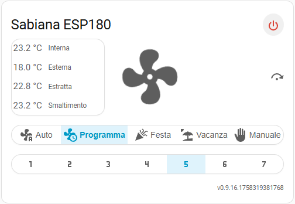

# SabianaVmcCard
Interfaccia grafica per vedere e comandare una VMC della Sabiana.



Questo progetto è strettamente collegato a [SabianaVmcToHomeAssistant](https://github.com/NWItaly/SabianaVmcToHomeAssistant) che permette di leggere/scrivere i dati della VMC tramite protocollo ModBus 485

**ATTENZIONE:** per funzionare la card necessita dei dati della VMC.

## ⚙️ Configurazione base della card

Esempio di configurazione minima in YAML:
``` yaml
type: custom:sabiana-vmc-card
entity_prefix: 'vmc_sabiana'
```

La card rileva automaticamente la lingua dell'interfaccia e mostra i testi tradotti secondo i file JSON.

### Entità e dati
| Entità | Tipo dato | Obbligatoria | Formato | Valori | Esempio configurazione YAML |
|-|-|-|-|-|-|
| entity_model | Modello | Sì || Testo  | sensor.vmc_sabiana_blk0_controller_model |
| entity_temp_in | Temperatura | Sì | °C | Numero con decimale | sensor.vmc_sabiana_blk1_temperature_t1 |
| entity_temp_out | Temperatura | Sì | °C | Numero con decimale | sensor.vmc_sabiana_blk1_temperature_t2 |
| entity_temp_extracted | Temperatura | Sì | °C | Numero con decimale | sensor.vmc_sabiana_blk1_temperature_t3 |
| entity_temp_disposal | Temperatura | Sì | °C | Numero con decimale | sensor.vmc_sabiana_blk1_temperature_t4 |
| entity_power | Binario | Sì || On/Off | switch.vmc_sabiana_vmc_power


## 📚 Guide dettagliate
- 📖 [Installazione](docs/INSTALLATION.md)
- 📖 [Sviluppo](docs/DEVELOP.md)
- 📖 [Best practice](docs/BESTPRACTICE.md)

## Licenza d'uso
Questo software è fornito "così com'è", senza alcuna garanzia espressa o implicita.
L'autore declina ogni responsabilità per eventuali danni diretti o indiretti derivanti dall'uso di questo progetto. L'uso è consentito esclusivamente per scopi personali, didattici o di test.
È vietata la distribuzione commerciale senza autorizzazione scritta dell'autore.

## Riferimenti esterni
- [Home Assistant](https://www.home-assistant.io/)
- [Docker](https://www.docker.com/)
- [Visual Studio Code](https://code.visualstudio.com/)

### TODO

- Integrazione con HACS
- Convertire l'attuale localizzazione con la versione i18 di HA.
- Visualizzare la maggior parte dei parametri a disposizione (almeno i più utili)
- Permettere di modificare i parametri della VMC

## FAQ
- **Q**: La card non si aggiorna con i nuovi valori, cosa fare?  
**A**: Svuota la cache del browser o apri in incognito, assicurati che Home Assistant aggiorni gli stati delle entità.

- **Q**: Come riavvio l’ambiente di sviluppo Docker?  
**A**: Usa i task explorer con i comandi ‘docker stop’, ‘docker start’ o ‘docker restart’.

- **Q**: Alcune entità non sono visibili, come posso risolvere?  
**A**: Verifica che le entità esistano e siano correttamente configurate in Home Assistant, e che i nomi corrispondano esattamente nel file YAML.

## 💬 Supporto

- 🐛 **Bug o problemi?** [Apri un Issue](../../issues)
- 📧 **Altro?** Contatta @NWItaly

---
⭐ **Ti piace il progetto?** Metti una stella! Aiuta altri utenti a trovarlo.